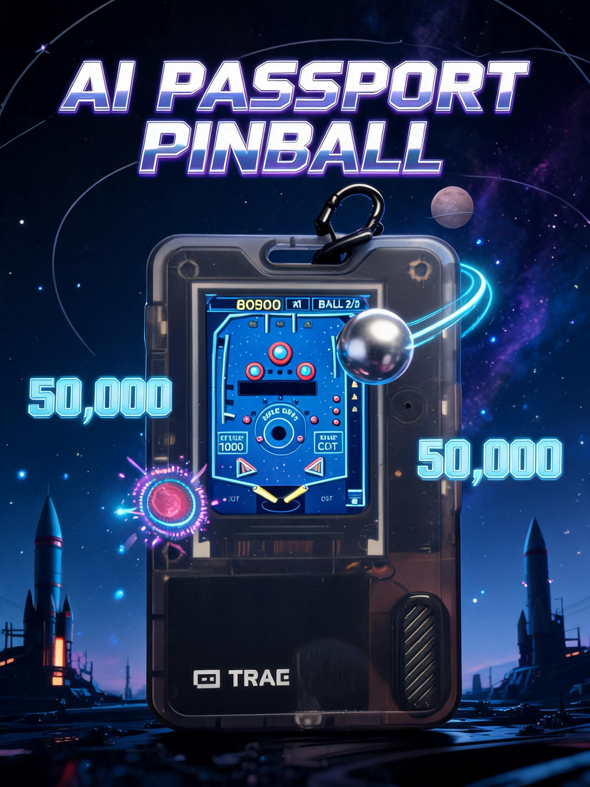
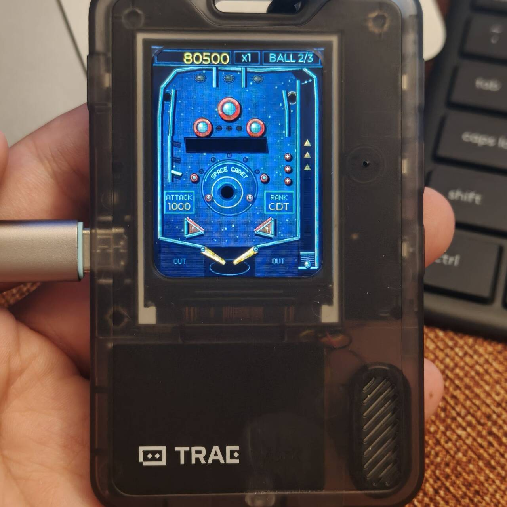
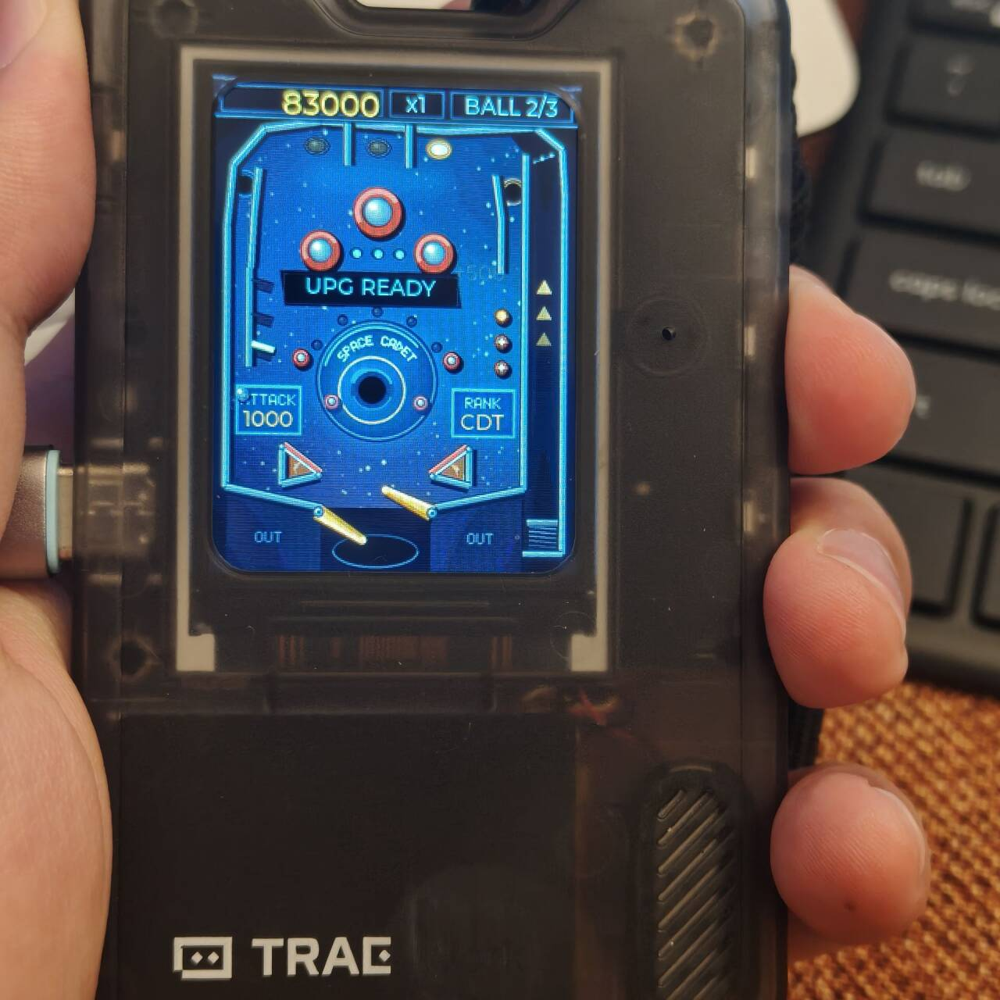

# AI Passport Pinball · 太空弹球



把 [FoloToy AI Passport](https://github.com/FoloToy/ai-passport) 变成一台掌上弹球机——复刻 Windows 经典 **3D Pinball / Space Cadet**，三颗按钮、三颗球、无限上头。

无需配网，开机即玩。

| 游戏中 | 升级就绪 |
|:---:|:---:|
|  |  |

## 怎么玩

| 按键 | 功能 |
|------|------|
| 上键 | 左挡板 |
| 下键 | 右挡板 |
| 确定键 | 按住蓄力，松开发射 |
| 确定键长按 | 暂停菜单 |

1. 开机进入标题画面，按任意键开始
2. 按住确定键蓄力，松开发射弹球
3. 用左右挡板接住球，撞击各种得分点刷分
4. 三颗球用完结算，挑战最高分

## 亮点

- **经典复刻**：台面布局、得分规则、倍率系统逐条对标原版 Space Cadet
- **bumper 升级**：挥挡板点亮升级灯，满三盏穿过车道即可升级，bumper 分值翻倍
- **倍率冲刺**：击倒左侧三个目标，倍率从 x1 一路飙到 x10
- **军衔晋升**：从 Cadet 到 Fleet Admiral，9 级军衔等你晋升
- **三大特殊洞**：黑洞（20000 分）、引力井（50000 分）、超空间洞（最高 150000 分）
- **球保存**：每颗球发射后 5 秒内掉球自动救回，不怕开局翻车
- **最高分榜单**：5 槽排行榜，NVS 持久化，断电不丢

## 快速上手（完整安装教程）

### 1. 安装 ESP-IDF

需要 [ESP-IDF v5.5.3](https://docs.espressif.com/projects/esp-idf/zh_CN/latest/esp32c3/get-started/)。

**Windows**：下载 [离线安装器](https://dl.espressif.com/dl/esp-idf/)，安装后打开 ESP-IDF 终端。

**Linux/macOS**：
```bash
git clone -b v5.5.3 --recursive https://github.com/espressif/esp-idf.git ~/esp/esp-idf
cd ~/esp/esp-idf && ./install.sh esp32c3
. $HOME/esp/esp-idf/export.sh
```

### 2. 获取代码 & 编译

```bash
git clone https://github.com/YeatsLiao/ai-passport-pinball.git
cd ai-passport-pinball
idf.py set-target esp32c3
idf.py build
idf.py merge-bin
copy build\merged-binary.bin build\ai-passport-pinball-full.bin
```

### 3. 烧录

```bash
# Windows: 将 COM3 替换为实际串口号（设备管理器中查看）
idf.py -p COM3 flash monitor

# Linux/macOS
idf.py -p /dev/ttyACM0 flash monitor
```

烧录完成后设备自动启动，屏幕显示标题画面，按任意键开始游戏。

## 烧录预编译固件（可选）

从 [Releases](../../releases) 下载 `ai-passport-pinball-full.bin`，使用 `esptool.py` 从 `0x0` 一步烧录（镜像已含 bootloader + 分区表 + 应用）：

```bash
esptool.py --chip esp32c3 -p COM3 --baud 460800 write_flash 0x0 ai-passport-pinball-full.bin
```

> 将 `COM3` 替换为设备实际串口号。Windows 可在设备管理器中查看。

## 文档

- [技术规格](docs/space-cadet-spec.md)：原版规则与分值对照
- [规格对照](docs/spec-compliance.md)：实现与原版的一致性

## 致谢

- [FoloToy AI Passport](https://github.com/FoloToy/ai-passport) — 硬件平台与 BSP 组件
- [SpaceCadetPinball](https://github.com/k4zmu2a/SpaceCadetPinball) — 原版规则与台面结构的逆向参考

## 许可证

MIT

---

# AI Passport Pinball (English)


Turn your [FoloToy AI Passport](https://github.com/FoloToy/ai-passport) into a pocket pinball machine — a faithful tribute to the classic Windows **3D Pinball / Space Cadet**. Three buttons, three balls, endlessly addictive.

No network needed. Power on and play.

| Gameplay | Upgrade Ready |
|:---:|:---:|
|  |  |

## How to Play

| Button | Action |
|--------|--------|
| Up | Left flipper |
| Down | Right flipper |
| OK | Hold to charge, release to launch |
| OK (long press) | Pause menu |

1. Power on to the title screen, press any key to start
2. Hold OK to charge power, release to launch the ball
3. Use left and right flippers to keep the ball in play
4. Three balls per game — chase the high score!

## Highlights

- **Classic tribute**: table layout, scoring rules, multiplier system faithfully adapted from Space Cadet
- **Bumper upgrades**: hit flippers to light upgrade lamps, then shoot through lanes to power up bumpers
- **Multiplier rush**: knock down three targets to boost from x1 all the way to x10
- **Rank promotion**: climb from Cadet to Fleet Admiral across 9 ranks
- **Three special holes**: Black Hole (20,000), Gravity Well (50,000), Hyperspace (up to 150,000)
- **Ball save**: 5-second ball save after each launch — no early drain worries
- **High score board**: 5-slot leaderboard, saved to NVS — persists across power cycles

## Quick Start

### 1. Install ESP-IDF

Requires [ESP-IDF v5.5.3](https://docs.espressif.com/projects/esp-idf/en/latest/esp32c3/get-started/).

**Windows**: Download the [offline installer](https://dl.espressif.com/dl/esp-idf/) and open the ESP-IDF terminal after installation.

**Linux/macOS**:
```bash
git clone -b v5.5.3 --recursive https://github.com/espressif/esp-idf.git ~/esp/esp-idf
cd ~/esp/esp-idf && ./install.sh esp32c3
. $HOME/esp/esp-idf/export.sh
```

### 2. Get the Code & Build

```bash
git clone https://github.com/YeatsLiao/ai-passport-pinball.git
cd ai-passport-pinball
idf.py set-target esp32c3
idf.py build
idf.py merge-bin
copy build\merged-binary.bin build\ai-passport-pinball-full.bin
```

### 3. Flash

```bash
# Windows: Replace COM3 with your actual serial port (check Device Manager)
idf.py -p COM3 flash monitor

# Linux/macOS
idf.py -p /dev/ttyACM0 flash monitor
```

After flashing, the device starts automatically and shows the title screen. Press any key to play.

## Flash Prebuilt Firmware (Optional)

Download `ai-passport-pinball-full.bin` from [Releases](../../releases) and flash from `0x0` with `esptool.py` (the merged image includes bootloader + partition table + app):

```bash
esptool.py --chip esp32c3 -p COM3 --baud 460800 write_flash 0x0 ai-passport-pinball-full.bin
```

> Replace `COM3` with your actual serial port. On Windows, check Device Manager.

## Documentation

- [Technical spec](docs/space-cadet-spec.md): original rules and scoring reference
- [Spec compliance](docs/spec-compliance.md): implementation vs. original consistency

## Acknowledgments

- [FoloToy AI Passport](https://github.com/FoloToy/ai-passport) — Hardware platform and BSP components
- [SpaceCadetPinball](https://github.com/k4zmu2a/SpaceCadetPinball) — Reverse-engineered reference for original rules and table layout

## License

MIT
